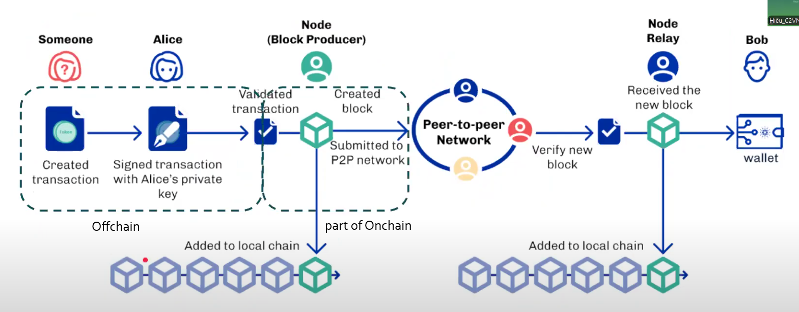
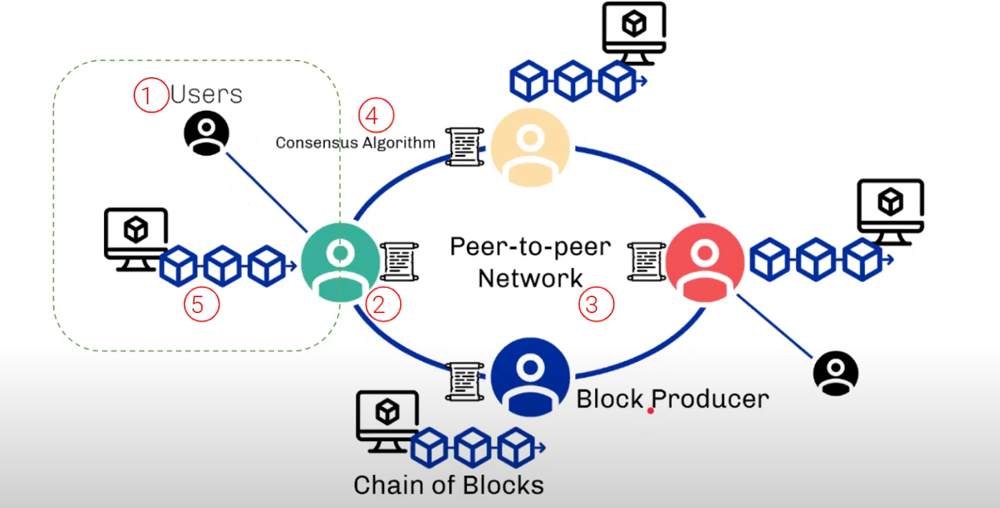

# Introduction
- **Ledger**: 
  + A **distributed database** that records the entire **history of transactions** and the **state of assets** on the network.
  + The **single source of truth**, including following components:

| Component                  | Role                                                                 |
|----------------------------|----------------------------------------------------------------------|
| **Ledger State**           | The current state: who owns how much ADA, which stake pools are active, etc. |
| **Ledger Rules**           | A set of rules that determine whether a transaction or block is valid |
| **Transactions**           | Transfers of assets or execution of smart contracts, recorded in the ledger |
| **UTxO (Unspent Transaction Output)** | Asset management model, similar to Bitcoin – each transaction creates new "unspent outputs" |
| **Epoch & Slot**           | Time structure: the ledger records blocks created in each slot (smallest time unit) and epoch (cycle) |

- **Techstack**:
  + Offchain: `cardano-cli` `Lucid`
  + Onchain: `Aiken`
## On-chain and Off-chain 
| Criteria                        | On-chain                                                | Off-chain                                                  |
|--------------------------------|----------------------------------------------------------|------------------------------------------------------------|
| **Position**       | On the blockchain (recorded in blocks)                  | Outside the blockchain network                             |
| **Transparency & Verifiability** | Fully transparent and publicly verifiable               | Harder to verify without a trusted third party             |
| **Speed & Cost**               | Slower, incurs transaction fees (e.g., gas fees)        | Faster, low or no transaction cost                         |
| **Security & Immutability**    | Very high, as it's recorded on the blockchain            | Depends on external systems, potentially alterable         |

- **Gas fee** is the transaction cost users pay on a blockchain to compensate for the computing energy required to process and validate transactions

## Transaction Lifecycle

In example, Alice send to Bob 5 ADA. 
1. **Create transaction**: created by user (Alice or anybody)
2. **Sign transaction**: must be signed by Alice's private key, proved that the transaction is belong to Alice and can't be changed by someone else.
3. **Validate transaction**: 
    + Send to Node (Block Producer, Minor, thợ đào) to validate.
    + Apply Ledger Rules to evaluate the transaction
4. **Create block**: will combine with another transactions to create a new block
5. **Add to Local Chain & Submit to P2P Network**
    + Add to local chain of the Node
    + Submit to P2P network in order to let the other nodes receive and execute.
6. **Verify new block**: The other nodes will verify the new node. If valid, the block will be accepted.
7. **Received by Node Relay**: make sure the new block is propagated to the entire network.
8. **Add to Local Chain & Wallet Updates**
    + Add to local chain of the other Nodes
    + Wallet updates: update the balance in Alice's (down) and Bob's wallets (up).

## Blockchain Components

## Hash 

## Cryptography 

## UTxO Model and Account Model 

## UTxO Model vs EUTxO Model 
